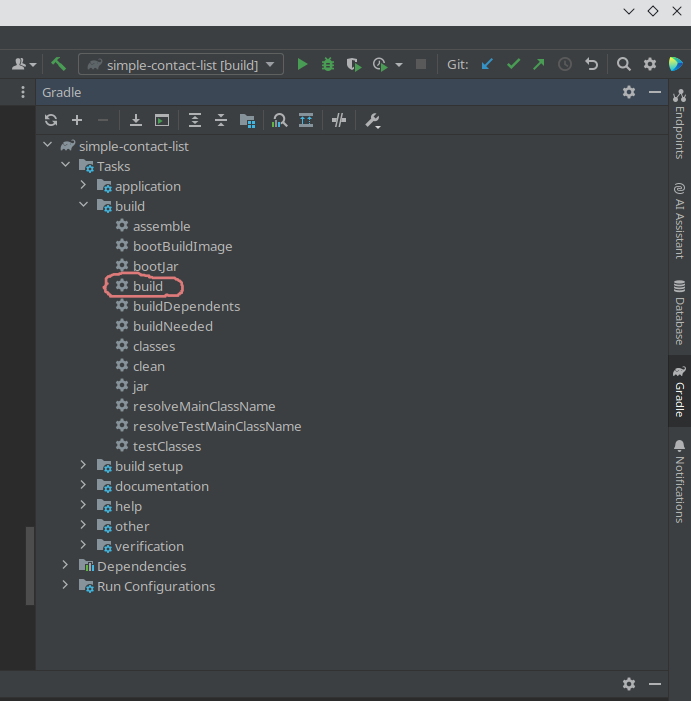

## Практическая работа №4
# Курса «Разработка на Spring Framework» от компании Skillbox.«Простой новостной канал»
## Цель практической работы
Закрепить знания, полученные по следующим темам:
<ol>
<li>Разработка REST API с использованием Spring MVC.</li>
<li>Валидация входящих запросов от клиентов.</li>
<li>AOP.</li>
<li>Создание слоя приложения для работы с базой данных с использованием Spring Boot Data JPA.</li>
<li>Написание спецификаций для фильтрации новостей при запросе.</li>
<li>Маппинг сущностей с использованием MapStruct.</li>
</ol>

## Документация RESTFull API
В приложении добавлен стартер по автоматической генерации документации по REST API Open API. 

После старта приложения документация доступна по адресу http://localhost:8080/swagger-ui/index.html
   
## Загрузка примерных исходных данных
Для более быстрого использования, чтоб не вводить каждый раз данные пользователей, категорий, новостей и комментариев,
реализован метод _loadDataExample_ содержащиеся в классе StartExampleData который выполняет сразу 
после старта всего приложения.
Активируется если в application.yml, содержится следующие параметры окружения приложения:
````
evn:
  example:
    enabled: true
````

## Компиляция:
Приложение собирается при использовании автоматического сборщика пакетов Gradle. Скомпилированный файл приложения можно получить, воспользовавшись инструментами среды разработки IntelIj Idea



или набрав команду в консоли, предварительно перейдя в корневую директорию проекта.
````shell
~/simple-news-channel$ gradle build
````
Jar-файл приложения находятся в папке ~/simple-news-channel/build/libs

## Использования Докера, запуск:

Для запуска приложения используется docker-compose. Но до этого надо сгенерировать образ программы.
Для того выполним команду в терминале находясь в папке приложения:

````shell
~/simple-news-channel$ docker build -t news-channel .
````
Сбилдится образ согласно настройкам в dockerfile

````
FROM openjdk:17-oracle
ENV HOME=/app
WORKDIR $HOME
COPY build/libs/simple-news-channel-0.0.1-SNAPSHOT.jar app.jar
CMD ["java", "-jar", "app.jar"]
````

Затем перейдём в директорию /docker и запустим docker-compose


````shell
~/simple-news-channel/docker$ docker-compose up
````
Запуск сконфигурирован в файле __docker-compose.yml__

````
version: '3'

services:
  app-backend:
    image: news-channel:latest
    ports:
      - "8080:8080"
    depends_on:
      - postgres
    environment:
      - SERVER_PORT=8080
      - SPRING_DATASOURCE_URL=jdbc:postgresql://postgres/db_news
  postgres:
    image: postgres:16
    ports:
      - "5432:5432"
    environment:
      - POSTGRES_USER=postgres
      - POSTGRES_PASSWORD=postgres
      - POSTGRES_DB=db_news
    volumes:
      - db_data:/var/lib/postgresql/data

volumes:
  db_data:
````

## Системные требования:
• Java 17
• Gradle
• Docker 24.0.2